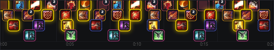
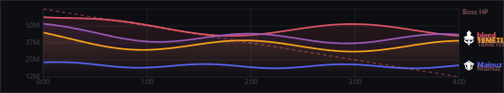

# Skill Breakdown Patch

This patch adds hit-by-hit skill tracking to ShinraMeter (any TeraToolbox build). Once installed, your encounters on [enragedon.com](https://enragedon.com) will show a **Skill Breakdown** timeline and **DPS Graph** tab.

### Skill Breakdown — every hit on a timeline

### DPS Graph — how the fight actually went

---

# ⬇️⬇️ DOWNLOAD ⬇️⬇️

## 👉 [**CLICK HERE TO DOWNLOAD THE PATCH**](https://github.com/Hazakurauwu/skill-breakdown-patch/releases/latest/download/skill-breakdown-patch-v1.0.zip) 👈

The download starts as soon as you click. After it finishes:

1. **Right-click the downloaded zip → Extract All** (don't run it from inside the zip)
2. Open the extracted folder and **double-click `install.bat`**
3. Done — start TeraToolbox and play

---

## How to install (step by step)

1. Close TeraToolbox completely (check the system tray near the clock)
2. Click the big **DOWNLOAD** link above
3. Extract the zip anywhere on your computer (right-click → Extract All)
4. Run **install.bat**
5. Start TeraToolbox again

The installer finds your TeraToolbox automatically. If it can't, a window opens so you can pick the folder yourself. It asks for administrator rights (needed if your toolbox is in Program Files) and backs up your original files before replacing anything.

That's it. Play any fight and the data shows up on enragedon.com automatically.

---

## How to uninstall

Close TeraToolbox, then run **uninstall.bat** (included in the zip). It restores your original files automatically and removes everything the patch added.

---

## Is this safe?

Yes. The source code is fully visible in this repo:

- [`src/RotationEnricher.cs`](src/RotationEnricher.cs) is the code that reads the skill hits and adds them to the upload
- [`src/Patcher.cs`](src/Patcher.cs) is the tool that builds the patched DamageMeter.dll

The patch only adds one thing to the upload: the list of skill hits that ShinraMeter already tracks locally. Nothing else is changed and nothing is sent anywhere other than enragedon.com.

The extra code is merged directly into `DamageMeter.dll` (a single self-contained file), so it works on any ShinraMeter build without depending on how that build loads assemblies. The installer also turns off auto-update in `module.json` so TeraToolbox does not overwrite the patched file.

---

## What gets unlocked

After playing a fight with the patch installed, the encounter page on enragedon.com will show two new tabs:

**Skill Breakdown** shows each skill on its own row with every hit placed on a timeline. You can zoom in, drag to scroll, and click a skill to focus on it.

**DPS Graph** shows how each player's DPS changed over the course of the fight. Switch between a running average and rolling 10s / 30s / 1m windows to spot burst phases, toggle players on and off, and overlay the boss HP line. Deaths are marked right on the curve.

## Only sent to enragedon.com

The hit-by-hit data is only attached to uploads going to **enragedon.com**. Any other upload targets you have configured keep getting the normal, lighter payload, so nothing changes for them.

---

## Notes

- Works on Windows 10 and 11
- The patched code is merged into `DamageMeter.dll` as a single self-contained file, so it works on any TeraToolbox ShinraMeter build (no dependency on how that build loads assemblies)
- If ShinraMeter updates to a new version, the patch needs to be reapplied with `build-patch.ps1`
