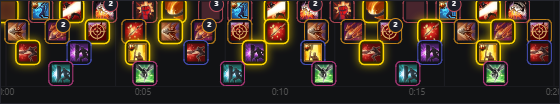
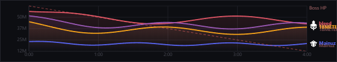
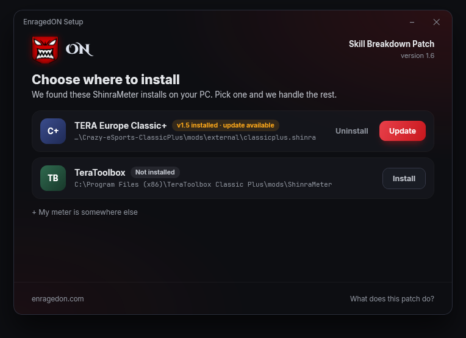
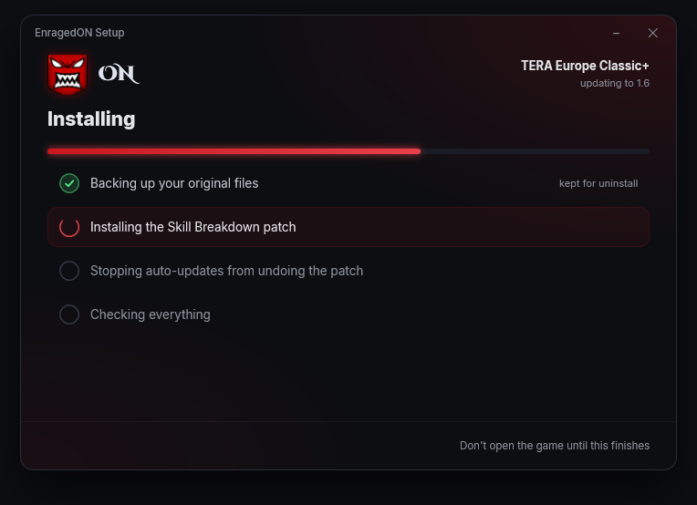
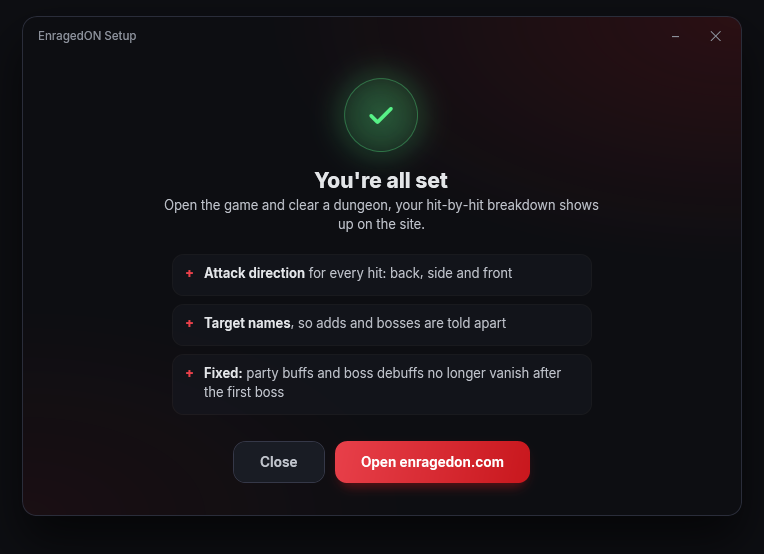

# Skill Breakdown Patch

Small patch for ShinraMeter that records every single hit you land. Install it once and your runs on [enragedon.com](https://enragedon.com) get two new tabs: **Skill Breakdown** and **DPS Graph**.

Works with the ShinraMeter that comes with TeraToolbox and with private server clients that ship their own build (Crazy eSports Classic+ and friends). The installer figures out which one you have.

### Skill Breakdown, every hit on a timeline


### DPS Graph, how the fight actually went


---

# ⬇️⬇️ DOWNLOAD ⬇️⬇️

## 👉 [**CLICK HERE TO DOWNLOAD THE INSTALLER**](https://github.com/Hazakurauwu/skill-breakdown-patch/releases/latest/download/EnragedON-Setup.exe) 👈

One file. Nothing to extract, nothing to configure.

---

## Install in 3 clicks

**1. Close the game** (and TeraToolbox if you use it). Check the tray next to the clock.

**2. Run `EnragedON-Setup.exe`.** It scans your PC and lists every meter it finds. Hit **Install** on the one you play with.



**3. Let it do its thing.** Backup, patch, and it also kills the meter setting that breaks buff tracking.



Start the game, clear a dungeon, done. Your fight shows up on the site with the new tabs.



If the scan misses your meter, hit **My meter is somewhere else** and point it at the folder. Admin rights are only requested when your meter sits in a protected folder like `Program Files`.

### "Windows protected your PC"

No code signing certificate yet (those cost money every year), so SmartScreen may throw a blue box the first time. Click **More info**, then **Run anyway**. Want to be extra safe? Drop the file on [VirusTotal](https://www.virustotal.com/gui/home/upload) first.

---

## Uninstall

Run `EnragedON-Setup.exe` again and hit **Uninstall**. Your original files come back from the backup it made during install.

---

## Is this safe?

Don't take my word for it, the whole thing is public:

- [`src/RotationEnricher.cs`](src/RotationEnricher.cs) reads the skill hits and puts them in the upload
- [`src/Patcher.cs`](src/Patcher.cs) builds the patched `DamageMeter.dll`
- [`installer/`](installer/) is the full source of `EnragedON-Setup.exe`: what it looks for, what it writes, what it backs up

What the patch does: adds the list of skill hits ShinraMeter already tracks on your PC to the upload it already sends. That's it. Nothing else changes and nothing goes anywhere except enragedon.com.

The code is merged straight into `DamageMeter.dll` as one self contained file, so it runs on any ShinraMeter build no matter how that build loads its assemblies. The installer also flips `disableAutoUpdate` in `module.json` so TeraToolbox can't overwrite the patched file, and rewrites the hash in `manifest.json` so the toolbox file check still passes.

The installer touches no firewall rules, installs no service, adds nothing to startup and makes zero internet connections. Plain .NET desktop app, not packed, not obfuscated. It runs on the same .NET your meter already uses, so there is nothing extra to install.

### "Export packets logs" gets turned off

The installer unticks this ShinraMeter option. With it on, the meter reparses your stored packets when a boss dies, the protocol version flips under the running meter, and it silently stops counting party buffs and boss debuffs until you restart it. That happens with or without this patch. Leaving it off is the fix.

---

## What you get

- **Skill Breakdown**: every hit in order with crits, timestamps and a zoomable timeline
- **DPS Graph**: the DPS curve of every player through the fight plus the boss HP drop

Only **one person in the party** needs it. The timeline gets recorded for everyone in the run.

---

## Build it yourself

```powershell
# patched DamageMeter.dll, both variants, lands in release/
powershell -ExecutionPolicy Bypass -File build-patch.ps1

# the installer exe, lands in release-installer/
dotnet publish installer -c Release -o release-installer
```

Needs .NET SDK 8.0 or newer. The DLLs in `release/` get embedded into the exe at build time.

Tests: `dotnet run --project installer/SetupTests` (copies real meter folders into `%TEMP%` and
runs the real install and uninstall code against the copies).

`install.ps1` and `uninstall.ps1` are still here for scripted installs. For everyone else the exe is the way.
